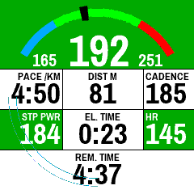
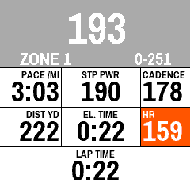
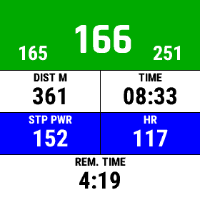
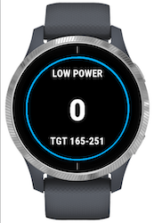

# RunPowerWorkout

RunPowerWorkout is a datafield that allows you to follow structured workouts based on Power on Garmin watches that support ConnectIQ 3.2.

Garmin doesn't yet support power as target in structured workouts natively, but as of ConnectIQ 3.2 it does enable datafields to read structured workout information, including power targets. This datafield reads those powertargets and dispays a gauge to visualize your current power output in relation to the target. 

It currently supports structured workouts for all watch models that are updated to ConnectIQ 3.2. For devices with power support (see table below), you need to have your Stryd paired as a power meter in order for the datafield to access the power values. For other devices you need to enter your stryd ANT ID.

### I have a watch with no support for ConnectIQ 3.2, can I still use your datafield ?

Yes ! However, you will not be able to receive structured workout alerts. You can set a zone for the whole activity and receive alerts if you are outside of its bounds.

### Features

The datafield displays:
* A gauge showing your current power in relation to the workout step targets. For low memory devices, the gauge is not displayed.
* The target power boundary values

If in 4 or 6 fields layout, it will also display the remaining time or distance for the current workout step, or lap time if outside of a workout.

For the 4 and 6 field layouts, you can choose the following metrics (in parenthesis, the character identifier for the string setting for low memory devices):

* Cadence (0)
* Current heart rate (1)
* Elapsed Time (2)
* Instance pace (3)
* Workout step pace (4)
* Lap pace (5)
* Workout step power (6)
* Lap power (7)
* Elapsed distance (8)
* Time of day (9)
* Average Pace (A)
* Average Power (B)
* Altitude (Only on high memory devices)
* Total Ascent (Only on high memory devices)
* Total Descent (Only on high memory devices)
* 5s [VAM](https://en.wikipedia.org/wiki/VAM_(bicycling)) (Only on high memory devices)
* ETA based on average pace (Only on high memory devices)
* ETA based on average power. [Uses the model from Stryd](https://blog.stryd.com/2020/01/10/how-to-calculate-your-race-time-from-your-target-power/). Correct weight, duration and elevation of the course needs to be set up. It is quite accurate but be aware that it is still very "beta". (Only on high memory devices)

Datafield layout is the following

| 1   | 3   | 5   |
| --- | --- | --- |
| 2   | 4   | 6   |

If you have a device with low memory, you won't be able to choose fields individually. You will have to enter a string representing the fields in order. For instance `368201` will display 

| Pace     | Step Power   | Cadence    |
| -------- | ------------ | ---------- |
| Distance | Elapsed Time | Heart rate |

This datafield will trigger an alert and/or vibrate if you are outside of the target range (up to three times). Colors can be shown for some metrics : HR zone, Power zone, Lap Power.

Display of units will automatically use your device settings.

### Settings

Through Garmin Connect Mobile or through Garmin Express you can edit the datafield settings. You can set the following settings :
* Set your current FTP/CP
* Choose to display power output and targets as percentage of your Functional Treshold Power / Critical Power or as plain watts
* Choose datafield layout (1, 4 or 6 fields) and which metrics to display.
* Enable/disable workout alerts
* Enable/disable vibrations on workout alerts
* Set the delay between alerts, and their amount.
* Choose the coloring behaviour: either no colors, text only, text and background.
* Enable/disable usage of custom fonts (for High memory devices)
* Enable/disable smaller decimal for the distance metric field
* Choose power average duration (from 1 to 30s)
* Power zone model to use when outside of a workout : Stryd, Jim Vance, Steve Palladino, 80/20, Van Dijk and Van Megen
* Set up an alternative layout (for High memory devices)
* Automatically switch every 5 seconds between two layouts (for High memory devices)
* Allow to choose between Lap/Step Power and Instant power for the top field (for High memory devices)
* Allow to choose between Lap Duration and Lap Distance in the bottom field, outside of workouts (for High memory devices)
* Alert on a static zone for watches without workout support (ConnectIQ <3.2). 
  Set to the zone number (for instance, if you have zones `1,2,3,X,4,Y,5`, Zone X would be 4 and Zone 4 would be 5), 0 to disable

### Download

The datafield can be downloaded in the ConnectIQ Store:
https://apps.garmin.com/en-US/apps/8c2fce29-0c7c-41f3-9a8f-5d3093c9cf2f

### Contribution

If you find an issue or want to improve this datafield, feel free to open Issues or PRs ! A slack channel exists if you want to get in touch more informally : https://join.slack.com/t/runpowerworkout/shared_invite/zt-ppmb361w-~tx7C56JvQ130c2b8ii_rQ

### Screenshots

##### 6 fields layout with custom fonts (High memory devices)

##### 6 fields layout with statute units (outside of a workout step)

##### Single field layout, inside a workout

##### 4 fields display on low memory devices, inside a workout

##### Alert

### Watch capability matrix

| Watch                        | Workout support ? | Power without ANT+ ? | Datafield Memory |
| ---------------------------- | ----------------- | -------------------- | ---------------- |
| Approach S60                 | ❌                 | ✅                    | LOW (32KB)       |
| Approach S62                 | ❌                 | ✅                    | HIGH (128KB)     |
| D2 Air                       | ✅                 | ❌                    | LOW (32KB)       |
| D2 Charlie                   | ❌                 | ✅                    | HIGH (128KB)     |
| D2 Delta                     | ❌                 | ✅                    | HIGH (128KB)     |
| D2 Delta Px                  | ❌                 | ✅                    | HIGH (128KB)     |
| D2 Delta S                   | ❌                 | ✅                    | HIGH (128KB)     |
| Descent Mk1                  | ❌                 | ✅                    | HIGH (128KB)     |
| Descent Mk2/Mk2i             | ✅ (in theory)     | ✅                    | HIGH (128KB)     |
| Enduro                       | ✅                 | ✅                    | LOW (32KB)       |
| Fenix 5                      | ❌                 | ✅                    | LOW (32KB)       |
| Fenix 5S                     | ❌                 | ✅                    | LOW (32KB)       |
| Fenix 5X                     | ❌                 | ✅                    | HIGH (128KB)     |
| Fenix 5 Plus                 | ✅                 | ✅                    | HIGH (128KB)     |
| Fenix 5S Plus                | ❌                 | ✅                    | HIGH (128KB)     |
| Fenix 5X Plus                | ❌                 | ✅                    | HIGH (128KB)     |
| Fenix 6                      | ✅                 | ✅                    | LOW (32KB)       |
| Fenix 6S                     | ✅                 | ✅                    | LOW (32KB)       |
| Fenix 6 Pro                  | ✅                 | ✅                    | HIGH (128KB)     |
| Fenix 6S Pro                 | ✅                 | ✅                    | HIGH (128KB)     |
| Fenix 6X Pro                 | ✅                 | ✅                    | HIGH (128KB)     |
| Forerunner 245               | ✅                 | ❌                    | LOW (32KB)       |
| Forerunner 245M              | ✅                 | ❌                    | HIGH (64KB)      |
| Forerunner 645               | ❌                 | ❌                    | LOW (32KB)       |
| Forerunner 645M              | ✅                 | ❌                    | HIGH (64KB)      |
| Forerunner 745               | ✅                 | ✅                    | HIGH (64KB)      |
| Forerunner 935               | ❌                 | ✅                    | LOW (32KB)       |
| Forerunner 945               | ✅                 | ✅                    | HIGH (128KB)     |
| Forerunner 945               | ✅                 | ✅                    | HIGH (128KB)     |
| MARQ Adventurer              | ✅                 | ✅                    | HIGH (128KB)     |
| MARQ Athlete                 | ✅                 | ✅                    | HIGH (128KB)     |
| MARQ Aviator                 | ✅                 | ✅                    | HIGH (128KB)     |
| MARQ Captain                 | ✅                 | ✅                    | HIGH (128KB)     |
| MARQ Commander               | ✅                 | ✅                    | HIGH (128KB)     |
| MARQ Driver                  | ✅                 | ✅                    | HIGH (128KB)     |
| MARQ Expedition              | ✅                 | ✅                    | HIGH (128KB)     |
| MARQ Golfer                  | ✅                 | ✅                    | HIGH (128KB)     |
| Venu                         | ✅                 | ❌                    | LOW (32KB)       |
| Venu (Mercedes-Benz)         | ❌                 | ❌                    | LOW (32KB)       |
| Venu 2                       | ✅                 | ❌                    | HIGH (256KB)     |
| Venu 2s                      | ✅                 | ❌                    | HIGH (256KB)     |
| Vivoactive 3                 | ❌                 | ❌                    | LOW (32KB)       |
| Vivoactive 3 (Mercedes-Benz) | ❌                 | ❌                    | LOW (32KB)       |
| Vivoactive 3M                | ✅                 | ❌                    | LOW (32KB)       |
| Vivoactive 3M LTE            | ❌                 | ❌                    | LOW (32KB)       |
| Vivoactive 4                 | ✅                 | ❌                    | LOW (32KB)       |
| Vivoactive 4s                | ✅                 | ❌                    | LOW (32KB)       |

### Pragati Font License

Copyright (c) 2012-2015, Omnibus-Type (www.omnibus-type.com omnibus.type@gmail.com)

Licensed under the [SIL Open Font License, 1.1](https://scripts.sil.org/cms/scripts/page.php?site_id=nrsi&id=OFL)
